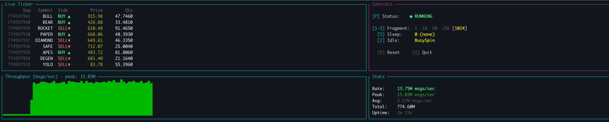
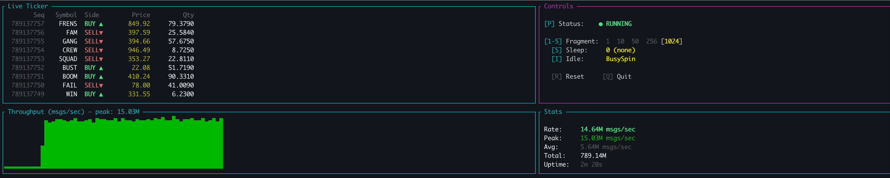

# aeron-java-rust-bridge

> **Part 1 of 3** in the Aeron Low-Latency Series

| # | Project | Focus |
|---|---------|-------|
| **1** | **aeron-java-rust-bridge** (this repo) | Throughput, backpressure & cross-language IPC |
| 2 | *aeron-ping-pong* (coming soon) | Latency measurement with round-trip benchmarks |
| 3 | *aeron-cluster-dashboard* (coming soon) | Cluster stats dashboard & monitoring |

---

**15M+ msgs/sec** | **Zero-copy IPC** | **Interactive TUI Dashboard**

Cross-language bridge between Java and Rust using [Aeron](https://github.com/real-logic/aeron) shared memory transport.

### Live Demo


*Interactive dashboard — tweak fragment limit, sleep, and idle strategy at runtime and watch throughput react in real-time*

### Screenshots

| Ramp-up phase | Full speed |
|:---:|:---:|
|  |  |
| Throughput climbing after parameter change | **13.75M msgs/sec** — Fragment=1024, Sleep=0, BusySpin |

| Sustained throughput | 794M messages processed |
|:---:|:---:|
|  |  |
| **14.6M msgs/sec** sustained — sparkline shows stable throughput | **14.9M msgs/sec** — 794M total messages, 2m 20s uptime |

```
┌─────────────────────────────────────────────────────────────────┐
│  MEASURED PERFORMANCE                                            │
├─────────────────────────────────────────────────────────────────┤
│  Throughput:     15,000,000+ msgs/sec (sustained)               │
│  Peak:           20,440,000  msgs/sec                           │
│  Message size:   48 bytes       (fits in single cache line)     │
│  Byte order:     Little-endian  (native on x86/ARM)             │
│  Transport:      Shared memory  (no syscalls, no kernel)        │
│                                                                  │
│  Latency measurement → Part 2: aeron-ping-pong (coming soon)   │
└─────────────────────────────────────────────────────────────────┘
```

## Why This Exists

Built to demonstrate hands-on experience with **Aeron IPC**, **cross-language messaging**, and **low-latency systems design**.

This project showcases:
- Shared memory transport between Java and Rust
- Binary message encoding (SBE-inspired)
- Production-grade backpressure handling
- Sub-microsecond latency patterns used in HFT

**Java publishes market data → Rust subscribes via shared memory**

## Architecture

```
┌──────────────────┐                      ┌──────────────────┐
│  Java Producer   │                      │  Rust Subscriber │
│                  │                      │                  │
│  - Market data   │    Aeron IPC         │  - Zero-copy     │
│  - 48-byte msgs  │ ──────────────────►  │    decoding      │
│  - Stream 1001   │   (shared memory)    │  - Symbol/Price/ │
│                  │                      │    Qty/Side      │
└──────────────────┘                      └──────────────────┘
                          │
                ┌─────────┴─────────┐
                │   Media Driver    │
                │ /tmp/aeron-bridge │
                └───────────────────┘
```

## Quick Start

### Prerequisites
- Java 21+
- Rust 1.70+
- Gradle

### Building

```bash
# Java
cd java && ./gradlew build

# Rust
cd rust && cargo build --release
```

### Running Tests

```bash
# Java (7 tests)
cd java && ./gradlew test

# Rust (21 tests)
cd rust && cargo test
```

### Running the Demo

**Terminal 1 - Start Media Driver:**
```bash
cd java && ./gradlew runMediaDriver
```

**Terminal 2 - Start Rust Subscriber:**
```bash
cd rust && cargo run --release --bin subscriber
```

**Terminal 3 - Start Java Producer:**
```bash
# Simple producer (50 messages with delay)
cd java && ./gradlew runProducer

# High-throughput producer (continuous, max speed)
cd java && ./gradlew runHighThroughputProducer
```

Watch the Rust subscriber receive messages from Java!

### Interactive TUI Dashboard

The TUI subscriber lets you tweak parameters at runtime and watch throughput react in real-time.

**Terminal 2 (instead of plain subscriber):**
```bash
cd rust && cargo run --release --bin tui-subscriber
```

**Keybindings:**

| Key | Action | Values |
|-----|--------|--------|
| `1-5` | Fragment limit | 1 → 10 → 50 → 256 → 1024 |
| `S` | Cycle sleep duration | 0 → 10μs → 100μs → 1ms |
| `I` | Cycle idle strategy | BusySpin → Yield → Backoff |
| `P` | Pause / Resume | Toggle consumption |
| `R` | Reset stats | Zero all counters |
| `Q` | Quit | |

**Try this:** Start with Fragment=1, Sleep=1ms — watch backpressure climb. Then press `5` (Fragment=1024) and `S` twice (Sleep=0) — watch throughput explode.

## Configuration

| Setting | Value | Location |
|---------|-------|----------|
| Aeron Directory | `/tmp/aeron-bridge` | Shared memory location |
| Channel | `aeron:ipc` | IPC transport |
| Stream ID | `1001` | Message stream identifier |
| Message Size | `48 bytes` | Market data message |

## Message Format

See [docs/message-format.md](docs/message-format.md) for the byte-level specification.

## Backpressure & Flow Control

### What Is Backpressure?

Backpressure occurs when a producer sends data faster than the consumer can process it. With bounded buffers, the system must decide what to do when the buffer fills up.

```
Producer (fast) ──→ [Ring Buffer] ──→ Consumer (slow)
                         │
                    Buffer fills up.
                    What now?
```

### Handling Options

When `publication.offer()` returns `BACK_PRESSURED`, there are four strategies:

| Strategy | Behavior | Trade-off |
|----------|----------|-----------|
| **Wait (spin)** | Busy-loop until space available | Lowest latency, 100% CPU |
| **Wait (backoff)** | Spin → yield → sleep progression | Balanced latency/CPU |
| **Fail** | Return error to caller | Caller decides what to do |
| **Drop** | Discard message, continue | No blocking, data loss acceptable |

**Choosing a strategy:**
- **HFT / Ultra-low latency:** Wait (spin) — every nanosecond matters
- **Production systems:** Wait (backoff) — adaptive CPU usage
- **Metrics / Telemetry:** Drop — losing some data points is acceptable
- **Critical data:** Fail — let application handle overflow

### Producer Backpressure

`publication.offer()` returns status codes indicating buffer state:

| Return Value | Constant | Meaning |
|-------------|----------|---------|
| `> 0` | *(position)* | Success — message queued |
| `-1` | `NOT_CONNECTED` | No subscribers attached |
| `-2` | `BACK_PRESSURED` | Buffer full — retry required |
| `-3` | `ADMIN_ACTION` | Internal housekeeping — retry immediately |
| `-4` | `CLOSED` | Publication shut down |
| `-5` | `MAX_POSITION_EXCEEDED` | Position limit reached |

**Buffer full scenario:**
```
Producer Position:  [===================>.......]
                    ↑ written           ↑ consumer position

When producer catches up to consumer:
                    [===========================]  ← FULL
                    offer() returns BACK_PRESSURED
```

### Consumer Flow Control

`subscription.poll()` returns the number of fragments read:

| Result | Meaning |
|--------|---------|
| `> 0` | Read that many fragments |
| `0` | No messages available |

Consumer backpressure differs from producer: it's not "can't accept" but "nothing to do."

**The Idle Problem:**
```java
// BAD: Burns CPU when no messages
while (running) {
    int count = subscription.poll(handler, 10);
    // If count == 0, spins forever at 100% CPU
}

// GOOD: Back off when idle
while (running) {
    int count = subscription.poll(handler, 10);
    idle.idle(count);  // If 0, backs off. If >0, resets.
}
```

**Consumer controls the pace** — Aeron tracks consumer position. If consumer stops reading:
1. Consumer position stops advancing
2. Producer's `offer()` eventually returns `BACK_PRESSURED`
3. Producer must wait or drop messages

**Slow Consumer Scenarios:**
```
Scenario A: Consumer keeps up
Producer: =====>
Consumer:    =====>
Gap is constant, no backpressure

Scenario B: Consumer falls behind
Producer: ===================>
Consumer:    =====>
Gap grows, eventually buffer fills, producer blocked

Scenario C: Consumer too slow, data loss risk
Producer: ==============================[WRAP]=====>
Consumer:    =====>
Without backpressure, producer could overwrite unread data
```

### Idle Strategies

Both producer and consumer use idle strategies to avoid burning CPU while waiting:

```
┌─────────────────────────────────────────────────────────────┐
│                    BackoffIdleStrategy                       │
│  BackoffIdleStrategy(100, 10, 1μs, 100μs)                   │
├─────────────────────────────────────────────────────────────┤
│  Phase 1: SPIN (iterations 1-100)                           │
│    └── Thread.onSpinWait() / std::hint::spin_loop()         │
│        • CPU hint, no syscall, stays on core                │
│        • Latency: ~0 nanoseconds                            │
│        • CPU: 100% on this core                             │
├─────────────────────────────────────────────────────────────┤
│  Phase 2: YIELD (iterations 101-110)                        │
│    └── Thread.yield() / std::thread::yield_now()            │
│        • Scheduler hint, may context switch                 │
│        • Latency: ~1-10 microseconds                        │
│        • CPU: ~50% (shared)                                 │
├─────────────────────────────────────────────────────────────┤
│  Phase 3: PARK (iterations 111+)                            │
│    └── LockSupport.parkNanos() / thread::park_timeout()     │
│        • Exponential backoff: 1μs → 2μs → 4μs → ... → 100μs │
│        • Latency: 1-100 microseconds                        │
│        • CPU: ~0% (sleeping)                                │
└─────────────────────────────────────────────────────────────┘
```

### Java Implementation

```java
final IdleStrategy idle = new BackoffIdleStrategy(
    100,   // maxSpins before yielding
    10,    // maxYields before parking
    TimeUnit.MICROSECONDS.toNanos(1),    // minParkNanos
    TimeUnit.MICROSECONDS.toNanos(100)   // maxParkNanos
);

while ((result = publication.offer(buffer, 0, length)) < 0) {
    if (result == Publication.BACK_PRESSURED) {
        idle.idle();  // spin → yield → park progression
    }
}
idle.reset();  // After success, next backpressure starts from spin
```

### Rust Implementation (Example)

The equivalent backoff pattern in Rust:

```rust
pub struct BackoffState {
    spins: u32,
    yields: u32,
    park_ns: u64,
}

impl BackoffState {
    pub fn idle(&mut self) {
        if self.spins < 100 {
            self.spins += 1;
            std::hint::spin_loop();
        } else if self.yields < 10 {
            self.yields += 1;
            std::thread::yield_now();
        } else {
            std::thread::park_timeout(Duration::from_nanos(self.park_ns));
            self.park_ns = (self.park_ns * 2).min(100_000);
        }
    }

    pub fn reset(&mut self) {
        self.spins = 0;
        self.yields = 0;
        self.park_ns = 1_000;
    }
}
```

### Available Agrona Strategies

| Strategy | Behavior | CPU | Latency | Use Case |
|----------|----------|-----|---------|----------|
| `BusySpinIdleStrategy` | Always spin | 100% | ~0ns | Dedicated core, max throughput |
| `BackoffIdleStrategy` | Adaptive | Varies | Varies | Production default |
| `YieldingIdleStrategy` | Always yield | ~50% | ~1-10μs | Shared CPU, low latency |
| `SleepingIdleStrategy` | Always park | ~0% | 1-100μs | Power saving |

### Why Not Thread.sleep()?

```java
Thread.sleep(1);           // Minimum 1 MILLISECOND = 1,000,000 ns
LockSupport.parkNanos(1000);  // Can do 1 MICROSECOND = 1,000 ns
```

`Thread.sleep(1)` is **1000x coarser** than `parkNanos`. Never use `Thread.sleep()` in latency-sensitive paths.

### Tuning Guidelines

| Scenario | Recommended Configuration |
|----------|--------------------------|
| Dedicated trading server, pinned cores | `BusySpinIdleStrategy` |
| General low-latency, shared machine | `BackoffIdleStrategy(100, 10, 1μs, 100μs)` |
| High-throughput, latency less critical | `BackoffIdleStrategy(50, 5, 10μs, 1ms)` |
| Cloud / power-constrained | `SleepingIdleStrategy` |

### Backoff Parameter Deep Dive

```
BackoffIdleStrategy(100, 10, 1000, 100000)
                    │    │   │      │
                    │    │   │      └── maxParkNanos (100μs)
                    │    │   └── minParkNanos (1μs)
                    │    └── maxYields (10)
                    └── maxSpins (100)
```

**Execution flow:**
```
idle() call #1-100:    Thread.onSpinWait()            ← 0 latency, 100% CPU
idle() call #101-110:  Thread.yield()                 ← ~1μs, ~50% CPU
idle() call #111:      LockSupport.parkNanos(1000)    ← 1μs sleep
idle() call #112:      LockSupport.parkNanos(2000)    ← 2μs sleep
idle() call #113:      LockSupport.parkNanos(4000)    ← 4μs sleep
...exponential backoff...
idle() call #N:        LockSupport.parkNanos(100000)  ← capped at 100μs

reset():               Resets to spin phase
```

### Producer vs Consumer Comparison

| Aspect | Producer | Consumer |
|--------|----------|----------|
| **Signal** | `offer()` returns `-2` | `poll()` returns `0` |
| **Meaning** | Buffer full, can't write | Buffer empty, nothing to read |
| **Risk** | Message loss or blocking | Wasted CPU cycles |
| **Solution** | Retry with idle strategy | Poll with idle strategy |
| **Controls** | Consumer read speed | Producer write speed |

### Handling Options Summary

**Producer backpressure options:**
```java
// Option 1: Spin-wait (lowest latency, highest CPU)
while (publication.offer(buffer, 0, length) < 0) {
    Thread.onSpinWait();
}

// Option 2: Yield (share CPU)
while (publication.offer(buffer, 0, length) < 0) {
    Thread.yield();
}

// Option 3: Adaptive backoff (recommended)
while ((result = publication.offer(buffer, 0, length)) < 0) {
    if (result == Publication.BACK_PRESSURED) {
        idle.idle();
    }
}
idle.reset();

// Option 4: Drop message (fire-and-forget)
if (publication.offer(buffer, 0, length) < 0) {
    droppedMessages++;
}
```

**Configuring buffer size (prevention):**
```java
// Larger buffer = more headroom before backpressure
String channel = "aeron:ipc?term-length=67108864";  // 64MB terms
// Default is 16MB per term, 3 terms = 48MB total
```

## Project Structure

```
aeron-java-rust-bridge/
├── java/
│   ├── src/main/java/com/crypto/marketdata/
│   │   ├── Producer.java              # Simple market data publisher
│   │   ├── HighThroughputProducer.java # High-performance publisher
│   │   ├── MarketDataMessage.java     # Message encoding/decoding
│   │   ├── AeronConfig.java           # Shared Aeron configuration
│   │   ├── MediaDriverLauncher.java   # Standalone Media Driver
│   │   └── MessageExample.java        # Usage examples
│   ├── src/test/java/com/crypto/marketdata/
│   │   └── MarketDataMessageTest.java # Unit tests
│   └── build.gradle
├── rust/
│   ├── src/
│   │   ├── lib.rs                     # Shared configuration & decoding
│   │   └── bin/
│   │       ├── subscriber.rs          # Plain-text subscriber
│   │       └── tui_subscriber.rs      # Interactive TUI dashboard
│   └── Cargo.toml
└── docs/
    └── message-format.md              # Binary message specification
```

## Dependencies

### Java
- Aeron 1.44.1
- Agrona 1.21.2

### Rust
- rusteron-client 0.1 (Aeron C bindings)
- ratatui 0.28 + crossterm 0.28 (TUI dashboard)
- crossbeam-channel 0.5 (lock-free messaging)

## Platform Requirements

- **Architecture**: x86-64 or ARM64 (little-endian)
- **OS**: macOS, Linux, or Windows
- **Java**: 21+
- **Rust**: 1.70+

**Note**: Uses native byte order (little-endian). Big-endian architectures are not supported.

## Troubleshooting

**Messages not arriving:**
1. Verify Media Driver is running: check `/tmp/aeron-bridge` exists
2. Restart in order: Media Driver → Subscriber → Producer
3. Check for firewall/permissions blocking shared memory

**Corrupted values (e.g., price shows 1.23e+15):**
- Likely byte order mismatch - ensure both Java and Rust use little-endian
- Verify MESSAGE_SIZE matches (48 bytes)

## License

See LICENSE file.

---

## Acknowledgments

Built with assistance from [llm-consensus-rs](https://github.com/szabelin/llm-consensus-rs) — a Rust-based LLM consensus server for code review and validation.
